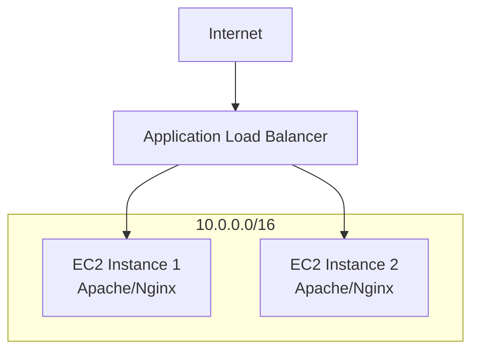

# AWS EC2 Load Balancer 

## Project Title: Load Balancer Simulation System

This project demonstrates how a load balancer distributes incoming client requests across multiple backend servers to improve performance and reliability. The system simulates traffic routing using different algorithms such as Round Robin and Least Connections. It also includes basic server health checking to ensure requests are only sent to active servers. The goal is to understand how load balancing improves scalability and prevents server overload.

## Project Objective

The objective of this project is to deploy a highly available web application using multiple EC2 instances behind an AWS Load Balancer. The Load Balancer distributes incoming traffic across multiple servers, ensuring fault tolerance, scalability, and high availability.

## Architecture Diagram

            
# Components

Virtual Private Cloud (VPC)

Public Subnets

Internet Gateway

Security Groups

EC2 Instances

Application Load Balancer (ALB)

Target Group

Route 53 (Optional)

CloudWatch Monitoring  

# Prerequisites

AWS Account

Basic Linux commands

AWS EC2 concepts

Networking fundamentals

Resources Required

Resource	Quantity

EC2 Instances	2

Load Balancer	1

Security Groups	2

Target Group	1

VPC	1

# Launch EC2 Instances

Login to AWS Console → EC2 → Launch Instance

# Configure Instance 1

Name	: WebServer-1

AMI	Amazon Linux 2023

Instance Type :	t2.micro

Key Pair	: Existing/New

Security Group	: Web-SG

Launch the instance.

# Configure Instance 2

Name	: WebServer-2

AMI	Amazon Linux 2023

Instance Type	: t2.micro

Key Pair	Existing/New

Security Group	: Web-SG

Launch the instance.

# Configure Security Group

Create Security Group

Name: Web-SG

Inbound Rules

Type	Port	Source

SSH	22	My IP

HTTP	80	Anywhere

HTTPS	443	Anywhere

Outbound Rules

Allow All Traffic

# Install Web Server

Connect to each EC2 instance using SSH.

ssh -i key.pem ec2-user@Public-IP

sudo yum update -y

sudo yum install httpd -y

sudo systemctl start httpd

sudo systemctl enable httpd

Create Sample Page on Server 1:

echo "<h1>Server 1</h1>" | sudo tee /var/www/html/index.html

Create Sample Page on Server 2:

echo "<h1>Server 2</h1>" | sudo tee /var/www/html/index.html

Verify:

http://<instance-public-ip>

# Create Target Group

EC2 → Target Groups → Create Target Group

Configuration

Parameter	Value

Target Type	Instances

Protocol	HTTP

Port	80

VPC	Default/Custom

Click Next.

Register Targets

Select:

WebServer-1

WebServer-2

Click:

Include as pending below

Create Target Group.

# Create Application Load Balancer

EC2 → Load Balancers → Create Load Balancer

Application Load Balancer

Basic Configuration

Parameter	Value

Name	Web-ALB

Scheme	Internet-facing

IP Type	IPv4

Network Mapping

Select:

VPC

Two Availability Zones

Public Subnets

Security Group

Attach:

Web-SG

Listener

HTTP : 80

Target Group

Select:

Web-Target-Group

Click:

Create Load Balancer

# Verify Health Checks

Target Groups → Targets

Check Status:

Healthy

Expected Output:

WebServer-1   Healthy

WebServer-2   Healthy

# Test Load Balancing

Copy ALB DNS Name:

http://web-alb-123456.ap-south-1.elb.amazonaws.com

Open Browser.

Refresh multiple times.

Expected Output:

Server 1

then

Server 2

depending on load balancing algorithm.

# Configure Auto Scaling (Optional)

EC2 → Auto Scaling Groups

Create Launch Template

Use:

Amazon Linux 2023

t2.micro

Web-SG

Create Auto Scaling Group

Parameter	Value

Desired Capacity	2

Minimum Capacity	2

Maximum Capacity	5

Attach to:

Web-ALB

# Monitoring

CloudWatch

CPU Utilization

Request Count

Healthy Host Count

Network Traffic

# Important Metrics

Metric	Purpose

CPUUtilization	Server load

RequestCount	Traffic

HealthyHostCount	Availability

TargetResponseTime	Performance

# Testing Scenarios

Test 1: Instance Failure

Stop one EC2 instance.

Expected:

ALB routes traffic to healthy instance only.
Test 2: High Traffic

Use:

ab -n 1000 -c 100 http://ALB-DNS/

Expected:

Traffic distributed across servers.
Test 3: Health Check Failure

Stop Apache service:

sudo systemctl stop httpd

Expected:

Instance marked unhealthy.

# Troubleshooting

Issue	Solution

Target unhealthy	Check HTTP service

Timeout	Verify Security Group

503 Error	Verify Target Group

No response	Check Listener Rules

SSH failure	Verify Key Pair and Port 22

# Project Outcome

Successfully deployed a highly available web application using AWS EC2 instances behind an Application Load Balancer. The Load Balancer distributes incoming traffic among multiple servers, improving reliability, scalability, and fault tolerance.
